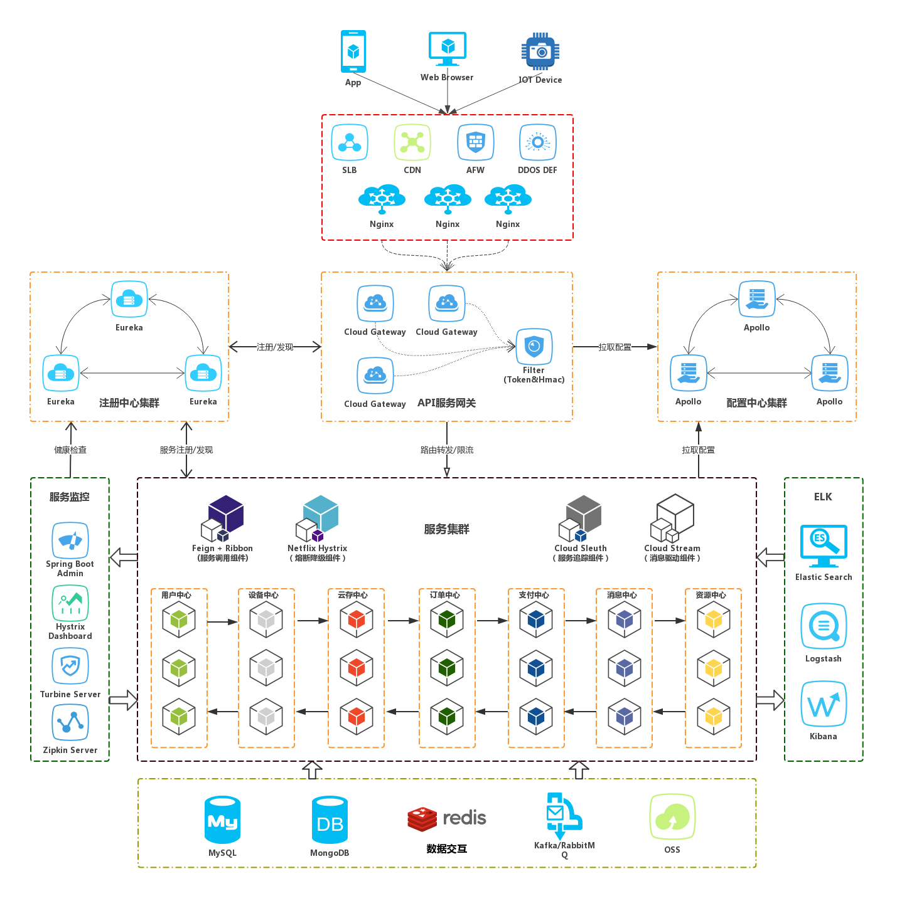

    
    
    

  

# easy-cloud（spring cloud 脚手架）

### Description

### Precondition
- [git](https://git-scm.com/)
- [java8](http://www.oracle.com/technetwork/java/javase/downloads/index.html) 
- [maven](http://maven.apache.org) 
- [mysql](https://www.mysql.com/downloads)
- [redis](http://redis.io/download)
- [kafka](http://kafka.apache.org/downloads)

### Software Architecture

### Features

#### Basis Function
|  功能     | 使用技术                    |   进度        |    备注   |
|----------|----------------------------|---------------|-----------|
|  注册中心 | Spring Cloud Eureka        |   ✅          |           |
|  配置中心 | Apollo                     |   ✅          |           |
|  消息驱动 | Spring Cloud Stream + kafka|   ✅          |           |
|  动态网关 | Spring Cloud Gateway       |   ✅          |负载均衡、路由转发、权重控制、多维度限流（服务/IP/用户）、统一鉴权、与Apollo集成实现动态路由|
|  认证中心 | Spring Security OAuth2     |   🏗          |授权/鉴权（客户端模式/用户模式/授权模式）|
|  服务容错 | Spring Cloud Hystrix       |   ✅          |           |
|  服务调用 | Spring Cloud OpenFeign     |   ✅          |           |
|  缓存管理 | Redis Cache Cloud          |   🏗          |           |

#### Operations Function
|  功能     | 使用技术                      |   进度         |    备注   |
|----------|-----------------------------  |---------------|-----------|
|  服务监控 | Spring Boot Admin2            |   ✅          |           |
|  断路监控 | Spring Cloud Sleuth + Zipkin  |   ✅          |           |
|  链路追踪 | Spring Cloud Hystrix Dashboard|   ✅          |           |
|  日志管理 | ElasticSearch+Logstash+Kibana |   🏗          |           |
|  监控告警 |                               |               |           |
|  APM方案  | SkyWalking                    |               |           |

#### Development Function
|  服务     | 使用技术                 |   进度         |    备注   |
|----------|-------------------------|----------------|-----------|
|  文档管理  | Swagger2                |   🏗           |           |
|  打包部署  | docker                  |   🏗           |           |

### Document

1. [Spring Boot](https://docs.spring.io/spring-boot/docs/2.1.4.RELEASE/reference/htmlsingle)
2. [Spring Cloud](https://cloud.spring.io/spring-cloud-static/Greenwich.RELEASE/single/spring-cloud.html)
3. [Spring Boot Admin2](http://codecentric.github.io/spring-boot-admin/2.1.4)
4. [Apollo](https://github.com/ctripcorp/apollo/wiki)
5. [Zipkin](https://github.com/spring-cloud/spring-cloud-sleuth/blob/master/README.adoc)
6. [MyBatis-Plus](https://mp.baomidou.com/guide/)

### Development Guidelines

1. [注册中心](./easycloud-registry/README.md)
2. [配置中心（待更新）](./docs/configuration/README.md)
3. [服务网关（待更新）](./easycloud-gateway/README.md)
4. [代码生成器](easycloud-samples/easycloud-samples-mybatis-plus/README.md)
5. [快速构建（待更新）](easycloud-modules/README.md)

### Deployment

### Release Notes

### FAQ